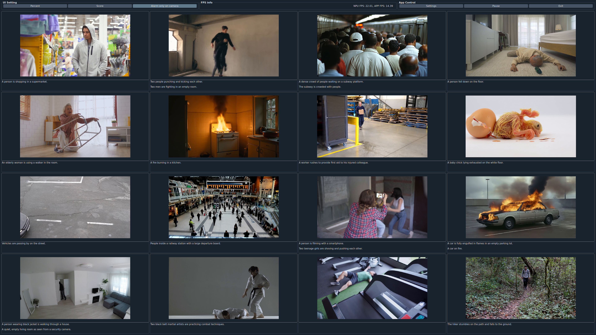

# DX-CLIP Demo

## Screenshot
*Real-time text-video similarity matching powered by CLIP on DeepX NPU*



---

## Overview

DX-CLIP Demo is a real-time video understanding application powered by the [CLIP](https://github.com/openai/CLIP) (Contrastive Language–Image Pretraining) model accelerated on DeepX NPU hardware.

The application matches live video frames against user-defined text sentences, displaying similarity scores in real time. It supports single-channel and multi-channel modes (up to 16 simultaneous video streams).

### Key Features

- Real-time text-video similarity scoring using CLIP
- Single-channel and multi-channel (up to 16 channels) video input
- Camera input support
- DeepX NPU-accelerated inference via `.dxnn` model
- Configurable display options (score, percentage, font, FPS, fullscreen, dark theme)

---

## Variants

### OpenCV

A lightweight, terminal-driven variant using OpenCV for video rendering.

- Minimal UI — output is rendered directly onto video frames using OpenCV
- Interactive text input via terminal (add/delete sentences at runtime)
- Suitable for headless or embedded environments
- Venv: `venv-opencv`

→ See [README-opencv.md](README-opencv.md) for setup and usage.

---

### PyQT5

A full-featured GUI variant built with the PyQT5 UI framework.

- Rich settings panel: assets path, channel count, FPS sync, fullscreen, dark theme, font layout options
- Multi-channel grid view with configurable center grid merge
- Camera mode for live input alongside video channels
- Venv: `venv-pyqt`

→ See [README-pyqt.md](README-pyqt.md) for setup and usage.

---

## Quick Start

```bash
# Setup (choose app_type: opencv or pyqt)
./setup.sh --app_type=pyqt --dxrt_src_path=/deepx/dx_rt

# Activate venv
source venv-pyqt/bin/activate

# Run
python -m clip_demo_app_pyqt.dx_realtime_demo_pyqt
```
